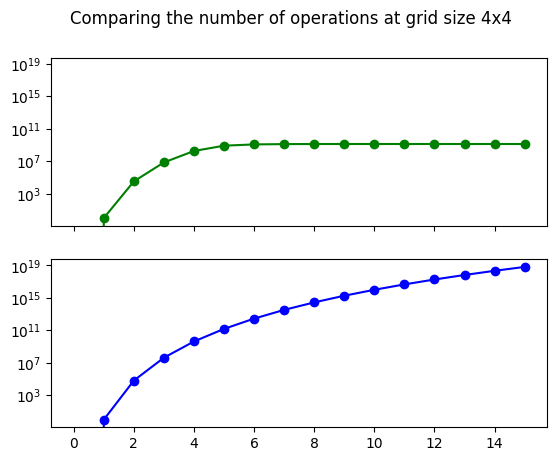

# Fillomino Investigation

[Fillomino](https://en.wikipedia.org/wiki/Fillomino) in a nutshell is a game of tiling polyominos on a grid.

You can play with that game [here](https://pwahs.github.io/fillominordle/) which is what initially piqued my interest in knowing all the games possible :)

I have here two algorithms to find the number of Fillomino games possible for any given `nxn` grid and a maximum possible polyomino size `m`.

# Testing Game validity

Across both algorithms, the game validity tester remains the same.

The way I test for game validity is by representing the grid as a graph and doing a Breadth-First-Search.
The Breadth-First-Search works by telling whether it was successful in searching for a polyomino of the size of the starting node for every starting node of the given grid.

For example if my grid was the following:
```
1 1 3
4 4 3
4 4 3
```
If you start from the bottom-left node whose value is `4`, the search will look for all of its neighbours (up, down, left and right) for `4`s. Since, four `4`s make a Tetromino and we are indeed looking for a Tetromino, this search succeeds.

Let's take a look at another example. In the same grid if I start from the top-left node whose value is `1`, the search will look for all of its neighbours for `1`s. Since, two `1`s make a Domino and we are looking for a Monomino, this search fails.

If any search within a grid fails then the grid doesn't form a valid Fillomino game, hence this example is
not a valid Fillomino game.

An example for a valid Fillomino game would be the following:
```
2 2 3
4 4 3
4 4 3
```
## Implementation Details

This Breadth-First-Search implementation caches its results so doing it over all nodes doesn't trigger another search,
it just returns the previously cached result.

There is a possibility of doing early returns on grids like:
```
1 1 1
1 1 1
1 1 1
```
We can return when we find more `1`s than one, so we don't have to search through the entire grid.
But the added complexity was not worth it and since its impractical to do it over large grids anyway there are no real gains.

# A Naive Search Algorithm

Now that we have a tester to test whether a grid is a valid game, we just have to give it all possible nxn Grids and a maximum polyomino size (`m`) with `1<=m<=n`. _Except_ that this technique generates rather large search-spaces.
It takes 20 minutes to generate all the 445 possible games.

# A Smarter Algorithm

One way that we can reduce our search-space is by observing that the sum of all the unique numbers in a valid grid is `n^2` or put it in another way, the sum of the sizes of the Fillominos in a valid grid is always equal to `n^2`.
As an example let's consider the following grid:
```
2 2 3
4 4 3
4 4 3
```
The sum `2+3+4` indeed equals `9`.

A proof of this fact is also trivial, since a polyomino of size `k` covers `k` tiles, if the number of tiles allowed to be covered was some `a` then the polyomino sizes will have to sum up to `a`. In our case, `a = n^2`.

So we can generate partitions of `n^2`, generate a grid from them and pass every single permutation of every generated
grid to our tester.
This ends up significantly shortening our search-space by a couple orders of magnitude.

Here are some graphs showing the differences (green is the smart algorithm and blue is the naive approach):

*Number of Operations for varying grid sizes with maximum possible polyomino size*


*Number of Operations for constant grid size of 3x3 and varying polyomino sizes*


*Number of Operations for constant grid size of 4x4 and varying polyomino sizes*



# Usage

To install the dependencies run:
```zsh
pip install -r requirements.txt
```

The scripts that you can run are:

a) `fillomino_general.py` (This has the naive algorithm)
b) `fillomino_general_smart.py` (This has the smarter algorithm)
c) `searchspace.py` (This generates the search-space that the two algorithms will go through)

All the scripts accept two optional CLI arguments; the grid size and a maximum polyomino size
```
script_name.py [grid size] [maximum polyomino]
```
For example,
`script_name.py 3 5` will run that script on a `3x3` grid with a maximum polyomino size of `5`.
